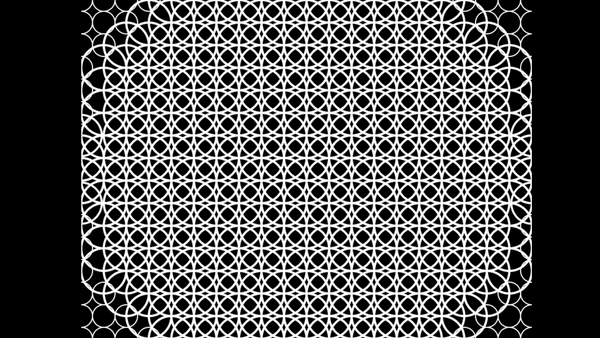

# GeometricAnimationSVG

Coursework Task: Required to produce a Scalable Vector Graphics (SVG) animation using a custom Animation Library made by our Professor.



## Installation

GHC Haskell Compiler required (Minimal Installers):

```download
https://www.haskell.org/downloads/
```

## Usage
Open the terminal in the project root directory and run:

```haskell
ghci MyAnimation.hs
outFile
```
## Credit
Animation Library: Ross Paterson, Lecturer and Professor in City, University of London.

## License
My Code is under the [MIT](https://choosealicense.com/licenses/mit/) license.
